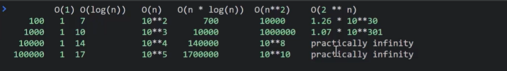
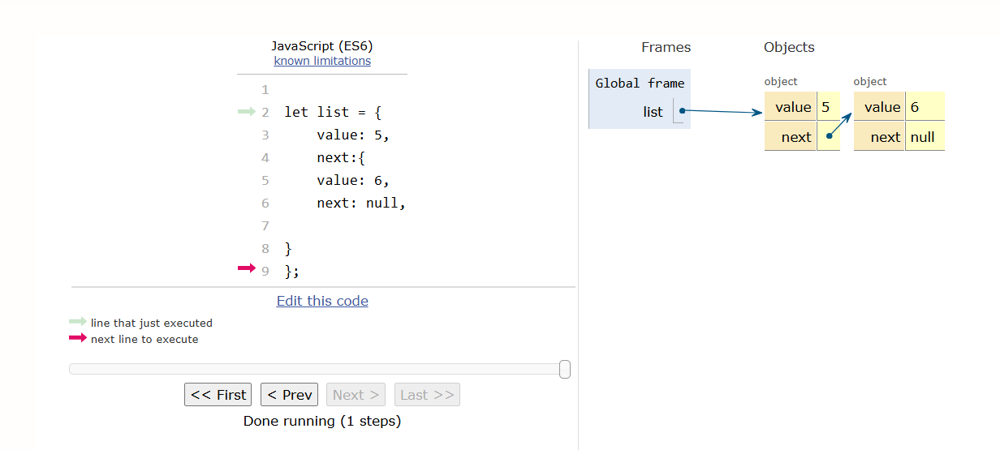

# Course introduction

- Explore data structures and algorithm concepts and their relation to everyday JavaScript development.
  A basic understanding of these ideas is essential to any JavaScript developer wishing to analyze
  and build great software solutions.

- You'll discover how to implement data structures such as hash tables, linked lists, stacks,
  queues, trees, and graphs. You'll also learn how a URL shortener, such as bit.ly, is developed
  and what is happening to the data as a PDF is uploaded to a webpage.

## Modules

1. [Big'O notation](#module-1-bigo-notation)
2. [Basic data structures: Lists, dictionaries, tuples, stacks, and queues.](#module-2-basic-data-structures-lists-dictionaries-tuples-stacks-queues)
3. [Recursion](#module-3-recursion)
4. [Linked lists and binary trees](#module-4-linked-lists-and-binary-trees)
5. [Heaps and sorting](#module-5-heaps-and-sorting)
6. Dynamic programming

# Module 1: Big'O notation

## Topic 1A: Introduction to Algorithms and Big'O notation

Big O notation is used to overestimate the time & space demands of a function

### Algorithm

Sequence of executable instructions to solve a task

Measuring algorithms

- Time needed to perform the algorithm
- Space required to execute the algorithm

Time and space complexity is estimated as "worst case"

(Typical to be asked to measure complexities in an interview)

### Big' O:

- Definition
- It is an overestimation(Worst case)
- always measured w.r.t the input size

Examples:
f(x) Function
g(x) Comparison function

- Not the algorithm itself but the nuber of steps required to solve the alg.

|f(x)| <= M \* g(x) for x >= x0

- f(x) will always take the same or less time to process as g(x)

O(g(x)) Overestimation

#### Typical O(g(x))

O(1)
O(n)
O(m + n) == O(max(m,n))
O(n \* log(n))
O(n^ 2)
O(n ** 3)
O(2 ** n)

## Topic 1B: Sum of first N numbers: linear algorithm

Example function:

function sumN(n) {
let solution = 0;
for (let i = 1; i <= n; i++){
solution += i;
}

    return solution;

}

sumN(10)

returns: 55

Number of steps represented by:
3 \* n + 6

9 n=1 9n
12 n=2 9n = 18 12<=18
15 n=3 9n = 27 15<=27
18 n=4 9n = 36 18<=36
306 n=100 9n=900 306<=900

O(n)

## Topic 1C: Nested loop and tuples: Quadratic algorithm

Still a linear algorithm as the processes is basicly just doubled

function sumN(n) {
let solution = 0;
for (let i = 1; i <= n; i++){
solution += i;
}

let solution2 = 0
for (let i = 1; i <= n; i++){
solution2 += i;
}

if (solution === solution2){
return solution;
}
return NaN;
}
O(n)

function getTuples(n) {
let tuples =[];

    for (let i = 1; i <= n; ++i) {
        for (let j = 1; j <= n; ++j){
            tuples.push([i, j]);
        }
    }
    return tuples;

}

### How to determine complexity of algorithm

Nested loops

Since for loop is in the for loop each instance of the first results in n processes.
Since the first loop has n processes it can be represented as n ** 2.
O(n ** 2)

## Topic 1D: Efficient Sum: Constant time algorithm

### O(1)

function sumN(n) {
let solution = 0;
for (let i = 1; i <= n; i++){
solution += i;
}

    return solution;

}

O(1)

function efficientSumN(n) {
return n/2^ (n + 1)
}

## Topic 1E: Understanding big O notation and logarithm

### Logarithm

2 ** 10 = 1024
2 ** X = 1024

log2(1024) = 10

**Essentially**

- How many times the value gets split in half.

Basicly the opposite of exponent

## Topic 1F: Analyzing complexity: Linear, logarithmic, and exponential growth

O(log(n))
Measure of how many zero's behind 1

## Topic 1G: Rules for simplifying complexity

O(n + n) ---> O(n)
O(2\*n) ---> O(n)
O(n+5) ---> O(n)

All the same because the constant is what keeps it an overestimation

O(n*log(n) + log(n)) = O(n*log(n))

Everything else is smaller than the O(n\*log(n))

O(n^2 + 2\*n +5) ---> O(n^2)

n^2 will have the biggest affect on the outcome
Generally don't want this as it grows rapidly

The function is determined by what factor causes the greatest effect

# Module 2: Basic data structures: lists, dictionaries, tuples, stacks, queues

## Topic 2A: Introduction to dictionaries, lists, stacks, queues, and tuples

JavaScript objects with keys and values
const o ={
key1: 'value'
key2: 'value2'
}
Called a dictionary in python. Called with the key

- Object: Dictionary = key and values
  - Building a dictionary: O(n) time + O(n) space
  - Accessing a dictionary: O(1)
- Array:
  - Lists
  - Stack
  - Queue
  - Tuple (Array of fixed length)

Lists = list of values

- Can add and delete values

Stack = Like a list but only care about the most right value

- .push() and .pop()
- You put an item on top and take the item on top

Queue = Like list but focuses on the value to most left

- .shift() takes a value from the left
- .unshift() Adds a value to the left
- .push() adds a value to the right
- .pop() Takes a value from the right

Kinda like first in first out

Tuples = Array with fixed length

- One variable that can store multiple values
- JS doesn't have tuple type
- TypeScript can define a tuple

## Topic 2B: Dictionary excercise: Most frequent element

This is a typical problem I might see in an interview and the thought process behind solving
**Suppose a JS array is given. Return the element that occurs the most often in the array.**

### This is simple pseudocode that needs to be made in JS

- Assume there are only primitive datatypes
  - Strings, number, booleans, null, undefined, symbol()
- Interviewer informs that these are the ones used
  - String, number(except NaN), boolean
- What happens if you have multiple answers?(Question to the interviewer)
  - You can assume that there is always 1 single element with the maximum occurence.(Response)
    - Don't have to worry about input
    - Don't waste effort on problems you don't have to solve.
- Come up with test examples
  - ['str'] ---> 'str'
  - [true, true] ---> true
  - [5, 2, 5] ---> 5
  - [5, 2, 2] ---> 2
  - [false, false, 2, 2, false] ---> false

Steps of the solution are important to communicate

- Need to show the interviewer what your thinking

result = null

maxCount = 0

for each elem of the arr:
currentCount = count(arr, elem)
Looks for each type of elemnt and adds to the count for that type

if currentCount > maxCount;

- maxCount = currentCount;
- result = elem
  return result;

### Converting the pseudocode to usable code

function countElementInArr(arr, target) {
let result = 0;

for (let elem of arr) {
if(elem === target) {
result += 1;
}
}

return result;
}

function solution(arr) {

1. state space
   let result = null;
   let maxCount = 0;
2. algorithm steps
   for (let elem of arr) {
   let currentCount = countElementInArr(arr, elem);
   if (currentCount > maxCount);
   maxCount = currentCount ;
   }
3. return value
   return result;
   }

**This comes out as an O(n^2)**

**Need to simplify so there are fewer steps**

result = null

maxCount = 0

sort(arr) **O(n\*log(n))** When sorted optimally

currentElement = null

currentCount = 0

for each elem of arr: **O(n)**

- if currentElem == elem:
  - increase currentCount by 1
- else:
  - if currentCount > maxCount:
    - result = currentElem
    - maxCount = currentCount
  - currentCount = 1
  - currentElem - elem

**O(n*log(n) + n) = O(n*log(n))**

### Using a dictionary

If we knew how to use a dictionary we would as it seem to be faster.

- O(n) and O(1)

#### Making a dictionary

false --> 'b_false'
15 --> 'n_15'
'abc' --> 's_abc'

- Need to check with the interviewer to make sure we can exclude edge cases
  Once we convert these values we have our keys for the dictionary
  {
  'b_false': 3,
  'n_2': 2
  }

**Thought process**
result = null;
maxCount = 0;

1. Build dictionary d from array **O(n)**
2. for each key in d: **O(n)**

- if d[key] > maxCount:
  - result = convert(key) **Gotta change it back**
  - maxCount = d[key]

3. return result

**The code made in console**

function valueToKey(value){

if (typeof value === 'string') {
return 's\_' + value;
}
if (typeof value === 'number') {
return 'n\_' + value;
}
if (typeof value === 'boolean') {
return 'b\_' + value;
}
}

function buildDictionary (arr) {
let d = {};
for (let elem of arr) {
let key = valueToKey(elem);
if (key in d) {
d[key] +=1;
} else {
d[key] = 1;
}
}
return d;

function solution (arr) {

1.  state space

    let result = null;
    let maxCount = 0;

2.  algorithm steps

    let d = buildDictionary (arr); **O(n)**

3.  return value

    return result;
    }
    }

This whole step wastes, at most, O(n) time

#### Using the dictionary

**Code generated in console**

function valueToKey(value){
if (typeof value === 'string') {
return 's\_' + value;
}
if (typeof value === 'number') {
return 'n\_' + value;
}
if (typeof value === 'boolean') {
return 'b\_' + value;
}
}

function keyToValue(key) {
if (key[0] === 's') {
return key.substring(2);
}
if (key[0] === 'n') {
return Number.parseFloat(key.substring(2));
}
return key[0] === 'b_true';
}

function buildDictionary(arr) {
let d = {};
for (let elem of arr) {
let key = valueToKey(elem);
if (key in d) {
d[key] +=1;
} else {
d[key] = 1;
}
}
return d;
}

function solution(arr) {
// 1. state space
let result = null;
let maxCount = 0;
// 2. algorithm steps
let d = buildDictionary(arr); // O(n)

for (let key in d) { // O(n)
if (d[key] > maxCount) {
result = keyToValue(key);
maxCount = d[key];
}
}
// 3. return value
return result;
}

Space complexity at worst case is O(n)

### Space complexity

Measured as the amount of extra space you need on top of the input
The amount of space needed as worst case in this example:

- Space for all the keys
- +2 characters per value
- values

## Topic 2C: Coding challenge

**Suppose a JS array on numbers is given. return the element that cannot have a pair.**

**You can assume that there is always exactly 1 result.**

**The numbers are between 1 and 1000000 and they are integers.**

[1] ---> 1

[1, 1, 1] ---> 1

[1, 2, 1, 2, 1] ---> 1

[1, 1, 2] ---> 2

### Thinking it out using a dictionary

1. Get array
2. Dictionary keys by number
3. For each key we check if there is an even or odd amount of them
4. Odd means no pair even means paired off.
5. Return element that has no pair

[JS can be found here](./CodingChallenges/2CCodingChallenge.js)

### Coding challenge walkthrough

Check the JS for the dictionary solution

#### Set solution

if you have a dictionary where the key just has just true value

- Represents if the key is in the data set
  - Member can only be in the set or not

Useful in this case as it lets you count 1 and 2, then knocks off the pairs as they form

#### bitwise XOR

Linear time

Constant space

**bitwise XOR**
^ is ussed as it's actual self in this section. Not an exponent as I've been using it

A B A^B
0 0 0 if the same
0 1 1 if different
1 0 1
1 1 0

9: 1001 [8 + 1]
6: 0110 [0 + 4 + 2 + 0]
9^6: 1111 [8 + 4 + 2 + 1] 15

15^6:
1111 15
0110 6

---

1001 9 [0 for same 1 for different]

Might not actually come up as an interview type question. They may ask for another excercise
as this one's too easy or already known.

## Topic 2E: Stack excercise: Parenthesis validation

1. Suppose an arithmatic exprssion is given.
2. Determine if the parenthesis are correctly used in the expression.
3. You can assume that the rest of the expression is correct, only the parenthesis can be badly aligned.

Correct: '(5+(3\*2+4)-3)+(8-2)'
Incorrect: '((5+3)' or '(5+3))'

Don't evaluate the expression.
Just focus on the form

### What do we need to do?

'(5+(3\*2+4)-3)+(8-2)'
We don't care about the numbers themselves just the form of the ()'s
'(())()'

- The count of the open and closed should be the same.
- At each point in time, there should be at least as many open ()'s
  parsed as close parenthesis.

Don't really need to use stack but that's what we're going wwith

#### Algorithm

'(())()'
'[(())()]{[()]}'

Thought process

1. As we read the excercise we put each open parenthesis in a stack
2. When we see a close parenthesis we pop the stack

- Remove the last element
- Pairs them up

[JS Here](./Module2/CodingChallenges/2ECodingChallenge.js)

## Topic 2F: Summary

Dictionary

- Uses keys to categorize all entries.
  Arrays(list)
  Stacks
- First in last out
  - Only the most recent entry is on top
    Tuples(trade values)
- [a, b] = [b, a]

# Module 3: Recursion

## Topic 3A: What is recursion, factorial example

[JS here](./Module3/topic3A.js)

Things that can be solved with recursion can also be solved without
It's a different way of thinking

- Has you solve problems more easily
- Very close to math proofs

Many interviews will have a recursive and iterative

### Direct Recursion

Functions calls itself

- You change some variables and function calls itself on the new variables

### Indirect recursion

functionA calls functionB
functionB calls functionA

Make sure to have a terminal condition

### Factorial

n\*(n-1)

## Topic 3B: Fibonacci excercise: Recursion and memoization

[JS Here](./Module3/topic3B.js)

### Excercise: Fibonacci sequence

Fibonacci sequence:

fib(0) = 0

fib(1) = 1

fib(n) = fib(n-1) + fib(n-2)

- The sum of the last 2 numbers

Functional programming is declaritive

- Lay out the rules of fib and let it run

### Memoization

Memoization involves storing the results of expensive function calls and returning
the cached result when the same inputs occur again. Instead of re-calculating a value
multiple times, the function checks a "memo" (usually an object or dictionary) to see
if the work has already been done.

- Optimisation technique
- Performance enhancement

#### fib optimization

We are going to use memo

**Memo**
Stores the value a previous calculation so that the calculation doesn't have to be
re-calculated multiple times.

### Solving iterratively

While recursion solves a problem by having a function call itself,
iteration solves it by using a loop to repeat a set of instructions
until a specific condition is met.

**Tail recursive**
"We have accumulator vairables. And then based on those variables we can calculate the result."

## Topic 3C: Fibonacci Excercise: Tail recursion and iterative technique

1. Take the fibonacci solution

- function fib(n) {
  if (n === 0) return 0;
  if (n === 1) return 1;
  let fib1 = fib(n - 1, memo);
  let fib2 = fib(n - 2, memo);
  return fib1 + fib2;
  }

2. Solve it in an iterative way

#### Solving iteratively and tail recursively

Use of:

- tuples
- Destructuring asignment
  - **Something to search later**

**Every recursive solution has an iterative solution**

## Topic 3D: Module 3 Summary

Used the factorial and fibonacci sequence to perform recursion

Recursion:

- Called itself

Learned about stack vs heap

Memoization:

- Storing of previous calc so that when called again the value can just be pulled instead of recalculated.

We now know recursion so we can use new datatypes more easily.

# Module 4: Linked lists and binary trees

## Topic 4A: Introduction to linked lists and binary trees

Recursive data structures:

- Linked list
- Binary tree

### Linked list:

Chain of elements where you have a value and a pointer(reference) to the next element that
looks exactly alike.

- Recursive as every element of a linked list can be interpretted as a linked list on itself
- One at the end has a null value
  - States "this is the end"

Node: The basic building block of a linked list. It typically consists of:

- Data: The actual value or information being stored (e.g., an integer or a string).
- Next Pointer: A reference or address that links to the succeeding node.

Head: A pointer that marks the beginning of the list, pointing to the very first node.

Tail: Often refers to the last node in the list, whose "next" pointer is usually set to NULL
or nullptr to signify the end of the chain.

Null: A special value used in the last node to indicate that there are no further nodes in the sequence.

[JS Here](/Module4/topic4A.js)

Linked list EX:

### Binary tree

Like a linked list

The difference is:

- There are 2 pointers for each element
  - left and right branch of the tree
- Can traverse back and forth

**Trees:**
Can have more than just left and right

Like a list

- 2 pointers
  Pointers don't point toward previous

Binary tree EX:
[Binary tree EX:](./Images/binaryTreeEx.png)

Used for different purposes

- Learn in this module

Both are defined recursively

## Topic 4B: Linked list excercise: filter duplicates

1. Suppose a linked list is given.
2. Filter out the duplicates from the list.
3. Return a reference of the original node of the list.
   [JS Here](./Module4/topic4B.js)

- linked list:

The main idea is to look at the value of the next element for the current element.
If they're the same passover the next value and check again.
Keep adjusting the next element until you reach a different value.
This become the next element for the first element of the line of same value elements.

## Topic 4C: Binary tree excercise: Maximum length

[JS Here](./Module4/topic4C.js)

Going to solve some excercies with binary tree

let node = {
value: 5,
left: leftItem,
right: rightItem
}

1. Calculate the maximum length of a binary tree.

- Going to solve recursively.

## Topic 4D: Binary tree excercise: Maximum sum

**Continuing on from 4C** 2. Calculate the largest sum in a binary tree from root to leaf.

## Topic 4E: Binary tree excercise: Traversal

**Continuing from 4C**

3. Traverse the eements of a binary tree:

- Preorder
- In order
- Postorder

# Module 5: Heaps and Sorting

## Topic 5A: Introduction

Gonna build on what we know and introduce heaps and sorting

**Sorting:** Simpler than what we've been doing. Often introduced earlier in learning but
can shift people to overuse it.

- Less efficient than dictionaries or other things depending on usage.
- complexity: n\*log(n)

## Topic 5B: Understanding binary heaps

**Binary Heaps**

Can be binary min heaps or binary max heaps.
Is itself a binary tree.
**Rules**

- You can insert elements into the binary heap.
  - Gets added to the end of the array.
- Parent-child relationships
  - Formula is:
    - childLeftIndex = parentIndex \* 2 + 1
    - childRightIndex = parentIndex \* 2 + 2
    - Assuming that the root is at element 0
- Has a specific property:
  - Min heap
    - Always has the smallest element of the heap in the root.(On the top)
      - Bubbling up: When you add a new element it compares itself to the element before it.
        If it is less then the one before they switch.
        Continues until it finds an element less than itself.
  - Max heap
    - Opposite of min heap.

## Topic 5C: Building a binary min heap

[JS Here](/Module5/topic5C.js)

It is made as a class

Constructor

- Can be called in multiple ways
  1.
  - let heap = new BinaryMinHeap()
    - Creates an empty array
  - let heap2 = new BinaryMinHeap([5, 1, 2])
  - heap2.heap
    - Combines them and bubbles it
  2.
  - Use constructor.
    - Initializes the heap as an empty array.
    - Use helper function.
      - Inserts each element

**Excercise:**

- After finishing the video.
- Is a tough excercise.
  Implement the binary heap myself. (Start to finish)
  - Will likely mess up.

## Topic 5D: Sorting Algorithms

Sorting is one of the first topics usually introduced

It is based on heaps which are based on binary trees.

Heap sort is optimal for time complexity. Not space complexity.

- Heap is o(n\*log(n))
- The idea:
  - We build a heap out of the array.
  - Delete all the minumums until we have something in the heap.

[JS Here](./Module5/topic5D.js)
3:28
